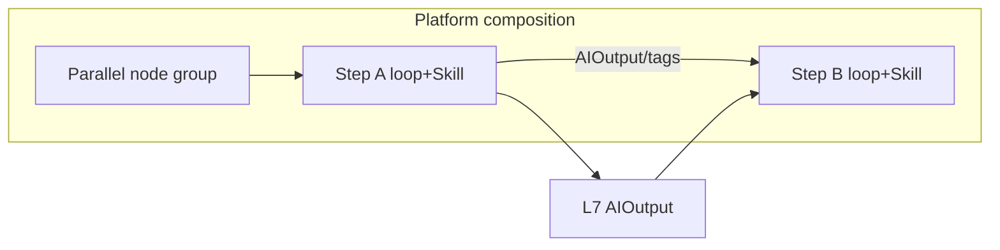

# Planning · Module 1: Background and orchestration principles

> **Core reference · Module 1** (platform control loop **Plan** · `agents/planning/`)  
> Fictional company: **Qingshu Mobility**  
> Architecture: [BLUEPRINT.md](../../BLUEPRINT.md) · [Design decisions](../design-decisions.md)  
> Version: V2.1 · 2026-08-07

---

## 1. Where Plan sits on the platform

An enterprise AI product = **4 platform loops + 3 tool classes + department Skills** (see blueprint). Plan is one of the four loops:

| Axis | Approach |
|------|----------|
| Platform loop | Read shared layer → gate / multi-step plan → (optional) drive a downstream Skill |
| Business variance | Attach Skills (e.g. `renewal_plan`); do not copy Act/Extract loops |
| Anti-AI-silo | Consume L7 shared assets only; no cross-department private store access |

This folder covers:

1. Plan and **composition contract** principles (this doc)  
2. Per-department type layer + Skill layer diagrams ([02](./02-module-2-department-flow-diagrams.md))  
3. Machine-readable `department_flows` and catalog ([03](./03-module-3-machine-readable-contract-and-catalog.md))  

**This phase**: contracts and machine-readable flows first; `agents/planning` runtime may still be `planned` (Story2 gate semantics are already demoable on Write/Govern tools).

---

## 2. Why docs still mention “sequence” — but not Agent relay

**At runtime**: one run executes **one Skill (one function)** and finishes inside that function’s control loop and tool allowlist.

“Sequence” in docs means **data dependency** only (e.g. renewal gate needs complaint tags, so someone usually ran ticket fill/tagging first and wrote the shared layer):

1. Run function A → write `AIOutput`  
2. **Separate run** of function B → read shared layer  

This is **not** Extract finishing and handing off to Act.

Parallel = two functions can be demoed independently with no required order (e.g. `ticket_fields` ∥ `fill_ticket` as optional paths in the same domain).

---

## 3. Sequential vs parallel

| `mode` | Meaning | Typical `via` |
|--------|---------|---------------|
| `sequence` | Upstream output is prerequisite for downstream | `AIOutput` · `tag_id` · `payload_schema:…` |
| `parallel` | No order inside the group | May be empty; merge then continue sequential edges |

---

## 4. Cross-department boundaries

| Allowed | Not allowed |
|---------|-------------|
| Read/write shared `AIOutput` / unified tags | Agent/Skill chat as the main path |
| One function = one Skill; one run at a time | “Upstream loop auto-hands to downstream” pipeline |
| Mark shared dependencies on flows via `via` | Plan as company-wide orchestrator / chained-run engine |

---

## 5. Anti-patterns

- One mega System Prompt as “enterprise brain”  
- Per-department copies of control loops / DataFetcher  
- Multi-Agent chat as collaboration  
- Plan loop posing as a single Orchestrator  
- Treating flows JSON as an implemented auto chained-run engine (contract ≠ runtime)  
- Agents talking to each other or “previous Agent passes to next”

---

## 6. Related docs

| Doc | Relation |
|-----|----------|
| [BLUEPRINT](../../BLUEPRINT.md) | Platform 4×3 architecture |
| [design-decisions](../design-decisions.md) | DD-03/06/07 etc. |
| [react/extraction/rag docs](../react/01-module-1-background-cross-dept-features-tone.md) | Other three loops |
| [skills/SCHEMA.md](../../skills/SCHEMA.md) | Skill contract; flow truth in JSON |
