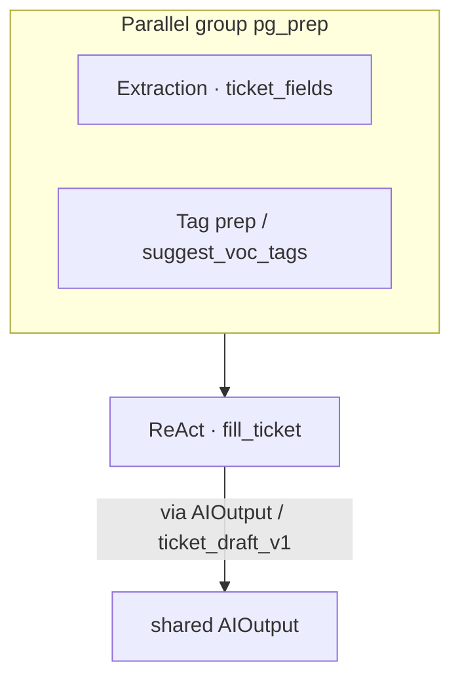
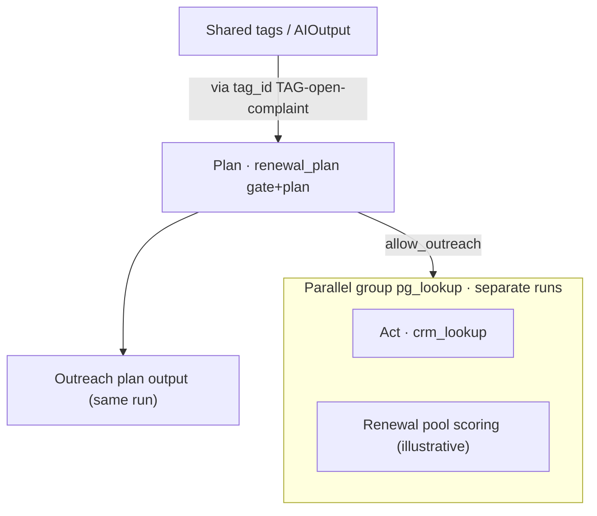

# Planning · Module 2: Department flow diagrams

> **Core reference · Module 2**  
> Each diagram has **type layer** + **Skill layer**; marks sequential edges and parallel groups  
> Demo must-run: Story1 (service) · Story2 (user ops gate)  
> Machine-readable source: `data/entities/department_flows.json`  
> Version: V1.0 · 2026-08-05

---

## Legend

| Symbol | Meaning |
|--------|---------|
| `→` / `mode: sequence` | Sequential: upstream output is prerequisite |
| `∥` / `parallel_groups` | Parallel: no order inside group |
| `via` | Shared contract (`AIOutput` / `tag_id` / schema) |
| ★ | `demo_ready: true` (aligns with Story) |

---

## 1. Service division ★ Story1 + RAG

**flow_id**: `service_ticket_to_shared` · Story1  
**flow_id**: `service_repair_qa` · RAG repair Q&A (`demo_ready: true`)

### Type layer (ticket fill)

```text
Extraction(ticket_fields)  ∥  Rule/tag prep (suggest_voc_tags etc.)
              ╲                ╱
               ↘              ↙
            ReAct(fill_ticket)  ——write→  AIOutput
```

### Type layer (RAG · orthogonal parallel)

```text
RAG(repair_kb)  ← assist answers / repair KB (not in Story1 chain)
```

- Parallel group `pg_prep`: `ticket_fields` and tag prep can run together (node `n_tag_prep`)  
- Sequential: prep done → `fill_ticket` writes shared (`via: payload_schema:ticket_draft_v1` / `AIOutput`)  
- RAG vs fill: **parallel / orthogonal**, see `docs/rag/02`

### Skill layer

| Node | skill_id | Role |
|------|----------|------|
| n1 | `ticket_fields` | Extract ticket draft |
| n2 | `fill_ticket` | Tool closure + `write_ai_output` |
| n_rag | `repair_kb` | Repair knowledge Q&A + citations |
| (cross-dept downstream) | `renewal_plan` · `voc_tagging` | Read-only consumers; not executed in this flow |



**Features**: `F-SVC-001` · `F-SVC-001-EXT`

---

## 2. User ops / App ★ Story2

**flow_id**: `user_ops_renewal_gate`

### Type layer

```text
Read shared tags / AIOutput
        →
Rule+LLM or Planning gate (open complaint → block)
        → (if not blocked)
Planning outreach plan / copy orchestration

Lookup ReAct(crm_lookup etc.)  ∥  renewal pool scoring (illustrative)
```

- Sequential: shared tags → gate → outreach plan  
- Parallel group `pg_lookup`: master-data lookup and renewal pool scoring can run in parallel (after gate or prep)

### Skill layer

| Node | skill_id | Notes |
|------|----------|-------|
| n_read | (store read) | Consumes `fill_ticket` / `ticket_fields` / `voc_entities` output |
| n_gate | `renewal_plan` | Plan Skill **shipped**: gate + (if allowed) short outreach plan in same run |
| n_plan_out | (placeholder) | Not a separate Skill; same-run `plan` field |
| n_crm | `crm_lookup` | Separate run after allow (F-UO-019), not Plan pipeline |
| n_score | (illustrative) | Scoring illustration; tools already on `renewal_plan` allow path |



**Features**: `F-UO-017` (demo_ready · `renewal_plan`); `F-UO-001` / `F-UO-019` still display or optional parallel

---

## 2.1 User ops · App RAG Q&A ★

**flow_id**: `user_ops_app_qa` · `demo_ready: true`

```text
RAG(repair_kb)  —— in-App repair/usage Q&A
        ∥ (unrelated)
Renewal gate user_ops_renewal_gate
```

- Orthogonal to renewal outreach; phase 1 reuses `repair_kb`  
- **Feature**: `F-UO-009`

---

## 3. Channel ops (illustrative · RAG node mounted)

**flow_id**: `channel_ops_board`

### Type layer

```text
ReAct(channel_ops) fetch metrics  ∥  RAG(policy_kb)
              ╲                    ╱
               ↘                  ↙
            Board/brief merge (Planning, still planned)
```

### Skill layer

- `channel_ops`: tier-1 health, alerts, etc.  
- `policy_kb`: policy/copy Q&A (no dedicated `channel_kb` yet; phase 1 reuses)  
- Whole flow `demo_ready: false` (merge node not implemented); both nodes can be try-run separately

---

## 4. Order / policy

### 4.1 Order review chain (illustrative)

**flow_id**: `order_policy_review` · `demo_ready: false`

```text
Extraction(order fields, planned) → Rule+LLM(policy tier gate) → ReAct(order assist, planned)
```

### 4.2 Policy copy RAG ★

**flow_id**: `order_policy_qa` · `demo_ready: true`

```text
RAG(policy_kb)  —— warranty/rebate/renewal red-line Q&A
        ∥ (side by side, not in review gate)
order_policy_review
```

- **Feature**: `F-POL-RAG`

---

## 5. VoC / research (illustrative)

**flow_id**: `voc_entities_to_shared`

### Type layer

```text
Extraction(voc_entities / voc_tagging) → write AIOutput
         ∥ (may parallel service fill for tags; consumers read shared after write)
```

### Skill layer

| skill_id | Relation |
|----------|----------|
| `voc_entities` · `voc_tagging` | Same-source tagging; may **parallel** service prep in different dept flows |
| Downstream | `renewal_plan` etc. read-only `AIOutput` |

**Note**: Collaboration with service `fill_ticket` is **shared output**, not cross-dept Agent chat.

---

## 6. HR · policy RAG ★

**flow_id**: `hr_policy_qa` · `demo_ready: true`

```text
RAG(hr_rules)  —— policy / agent SOP Q&A
```

- **Feature**: `F-HR-001`

---

## 7. Manufacturing QC / IoT quality (illustrative)

**flow_id**: `iot_quality_inspect`

> Quality role lives under `iot` in catalog; no separate “manufacturing” department_id — illustrative placement.

### Type layer

```text
Vision(inspection/QC images, planned) ∥ Extraction(OBD/QC fields, planned)
                ╲              ╱
                 ↘            ↙
              Rule+LLM or ReAct merge → write alert/shared tags
```

### Skill layer

- Parallel: image understanding and structured fields  
- Sequential: after merge write `AIOutput` / Alert for channel or service read-only

---

## 8. Demo must-run checklist

| Story / line | flow_id | demo_ready | Notes |
|--------------|---------|------------|-------|
| Story1 | `service_ticket_to_shared` | ✅ | Ticket assetization |
| Story2 | `user_ops_renewal_gate` | ✅ | Read shared → gate; outreach Skill runtime may still be planned |
| RAG repair | `service_repair_qa` | ✅ | repair_kb |
| RAG App | `user_ops_app_qa` | ✅ | reuses repair_kb |
| RAG policy | `order_policy_qa` | ✅ | policy_kb |
| RAG HR | `hr_policy_qa` | ✅ | hr_rules |

Next module: [03 · Machine-readable contract and catalog wiring](./03-module-3-machine-readable-contract-and-catalog.md)
