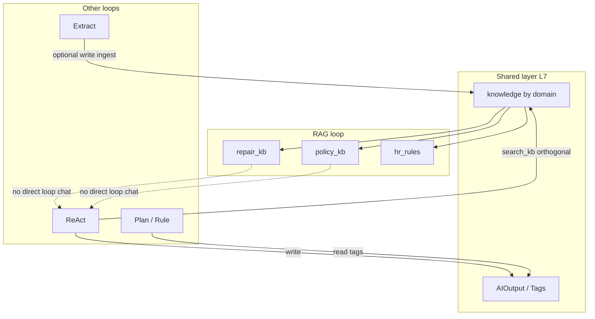

# RAG · Module 2: Cross-loop relationship orchestration

> **Core reference · RAG Module 2**  
> In-department: RAG Skills vs Extract / Act / Plan / Rule+LLM / Vision — **parallel · sequential · orthogonal**  
> Cross-department: shared layer only (`AIOutput` / tags / unified kb); no Multi-loop chat  
> Machine-readable: may live in `department_flows.json` (RAG nodes `agent_type: rag`)  
> Version: V1.0 · 2026-08-05

---

## 0. Three relationship types (global)

| Relation | Definition | Demo behavior |
|----------|------------|---------------|
| **Orthogonal** | Same Tool (`search_kb`) usable from RAG loop or ReAct tool step; paths independent | No required order; “shared tools, different loops” |
| **Parallel** | No data prerequisite; can trigger together; outputs may merge | `parallel_groups`; side-by-side cards |
| **Sequence** | Upstream output is downstream prerequisite (schema / AIOutput / updated kb slice) | Cards mark dependency; phase 1 **no auto chain** |

Anti-pattern: separate vector DB + DataFetcher per “repair loop / policy loop.”

---

## 1. By department: RAG ↔ other loops

### 1.1 Service division ★

```text
[RAG · repair_kb]  ←—— pure knowledge Q&A (assist reply / repair KB)
        ∥ orthogonal
[ReAct · fill_ticket / crm_lookup]  ←—— master data lookup, write AIOutput
        ∥ optional parallel (Story1)
[Extract · ticket_fields / voc_*]
```

| RAG Skill | Other | Relation | via / notes |
|-----------|-------|----------|-------------|
| `repair_kb` | ReAct `fill_ticket` | **Orthogonal / optional parallel** | Fill does not depend on RAG; agent may Q&A then fill (human order) |
| `repair_kb` | ReAct `crm_lookup` | **Parallel prep → human merge answer** | Vehicle/ticket lookup ∥ repair KB retrieval, then compose reply (F-SVC-003) |
| `repair_kb` | Extract `ticket_fields` | **Parallel** | Separate writes; no hard edge |
| `repair_kb` | Plan / Rule | **No phase-1 edge** | Complaint reports etc. are Plan, not RAG chat |

**No edge**: RAG → write_ai_output as Story1 main path (Story1 is ReAct/Extract). RAG phase-1 success = **grounded final answer + chunk citations**; optional AIOutput write is side-path only.

---

### 1.2 User ops / App

```text
Shared tags / AIOutput
        → (sequential)
Rule/Plan · renewal_plan gate
        ∥
[RAG · repair_kb / app_qa]  ← in-App Q&A, unrelated to renewal gate
```

| RAG Skill | Other | Relation | Notes |
|-----------|-------|----------|-------|
| App Q&A | Story2 `renewal_plan` | **Unrelated / parallel coexistence** | Renewal outreach does not read RAG; gate reads tags |
| App Q&A | ReAct unified service | **Optional sequential** | RAG FAQ first, complex cases to ReAct lookup (phase 2) |
| KB auto-update F-UO-010 | Extract | **Sequential** | Extract summary → ingest → RAG can retrieve new content |

---

### 1.3 Order / policy

```text
Extract(policy fields) → Rule+LLM(tier gate) → ReAct(order assist lookup)
         ∥
   [RAG · policy_kb]  ← copy Q&A, does not replace gate
```

| RAG Skill | Other | Relation | Notes |
|-----------|-------|----------|-------|
| `policy_kb` | Extract policy parse | **Optional parallel** | Structured tiers from extract; RAG answers “what is warranty” |
| `policy_kb` | Rule+LLM rebate/risk | **Orthogonal** | Rule tables decide; RAG does not change tier |
| `policy_kb` | ReAct order review | **Parallel prep** | Order lookup ∥ policy KB retrieval, then suggest |

Hard sequential dependency: **not** “RAG before Rule” — gate uses structured fields / rule tables.

---

### 1.4 Channel ops ★ (flow exists)

**flow_id**: `channel_ops_board` (`department_flows.json`)

```text
ReAct(channel_ops) fetch metrics  ∥  RAG(policy/channel)
              ╲                    ╱
               ↘                  ↙
            Board/brief merge (Plan or NLG, planned)
```

| Node | Relation | via |
|------|----------|-----|
| `n_ops` ∥ `n_rag` | **Parallel group** | No order |
| Both → merge output | **Sequential merge** | Metrics + KB citations → brief |

Phase 1: parallel group can run ReAct `channel_ops`; RAG node when loop ready, **no auto chain**.

---

### 1.5 Four war zones / new retail

| Chain | Relation | Notes |
|-------|----------|-------|
| Offline Q&A RAG ∥ order ReAct | **Parallel** | F-WZ-001 Q&A vs F-WZ-002 review |
| Service RAG ∥ inventory/order ReAct | **Parallel** | F-RET-001/002 |
| Pickup talk-track RAG → Plan activation pack | **Weak sequential** | KB citations into A–E pack copy (planned) |

---

### 1.6 HR

| RAG Skill | Other | Relation | Notes |
|-----------|-------|----------|-------|
| `hr_rules` | ReAct employee assistant tool step | **Orthogonal** | Phase 1primary RAG loop; ReAct `search_kb(hr)` illustrative |
| `hr_rules` | Extract role matching | **Parallel** | Recruiting: Q&A ∥ resume field extract |
| `hr_rules` | Other departments | **Shared read-only** | Cross-dept consumes same `hr` domain, no duplicate library |

---

### 1.7 Data lab / shared layer

| Role | Relation |
|------|----------|
| Unified index / DataFetcher.knowledge | **All RAG Skills depend** (base sequential: docs + index first) |
| Extract asset ingest → kb | **Sequential supply** (📋) |
| Smart ask-data ReAct | **Orthogonal**: numbers ≠ docs; semantic gloss may use RAG side path |

---

### 1.8 IoT / VoC / procurement etc.

| Department | Typical relation | Phase 1 |
|------------|------------------|---------|
| IoT | Rule alert ∥ RAG explains OTA docs | Display |
| VoC | Extract tagging → Plan report; RAG guide standalone | Display |
| Procurement | Rule risk ∥ RAG clauses (no kb) | Display |
| Vision QC | **No RAG edge** | Vision primary |

---

## 2. Cross-department matrix (summary)



| From \ To | Extract | ReAct | Plan/Rule | Vision |
|-----------|---------|-------|-----------|--------|
| **RAG** | Parallel (mostly) | Orthogonal or parallel prep | Weak sequential merge (brief) | None |
| **Extract → RAG** | — | — | — | — |
| (after ingest) | **Sequential kb supply** | — | — | — |

---

## 3. RAG flows in machine-readable truth

| flow_id | department_id | demo_ready | Node relation |
|---------|---------------|------------|---------------|
| `service_repair_qa` | service | ✅ | Single RAG `repair_kb`; **parallel** with Story1 |
| `user_ops_app_qa` | user_ops | ✅ | Single node; **parallel unrelated** to `user_ops_renewal_gate` |
| `order_policy_qa` | order_policy | ✅ | Single `policy_kb`; parallel to order review chain |
| `hr_policy_qa` | hr | ✅ | Single `hr_rules` |
| `channel_ops_board` | channel | half-ready | ReAct `channel_ops` ∥ RAG `policy_kb` → merge still planned |

Source: `data/entities/department_flows.json`. Maintenance: sync diagram changes with [docs/planning/02](../planning/02-module-2-department-flow-diagrams.md) and this file.

---

## 4. Web / ops copy

| Scenario | Guidance |
|----------|----------|
| Story1/2 | **Do not depend** on RAG; RAG is a third “knowledge loop” demo line |
| Business wall | `demo_ready` RAG Skills can “open run”; other sections show relationship notes |
| Same page as ReAct | Mark “optional parallel” or “orthogonal search_kb”; avoid implying RAG must run first |

Next module: [03 · Phase-1 demo scope and schedule](./03-module-3-phase-1-demo-scope-and-schedule.md)
